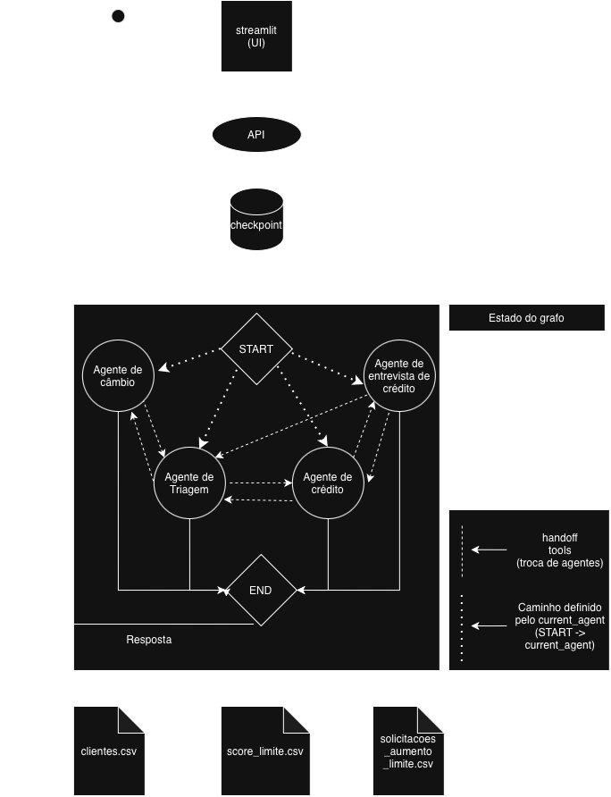

# 🏦 Banco Ágil — Atendimento com Agentes de IA


Sistema de atendimento bancário conduzido por quatro agentes de IA especializados —
triagem, crédito, entrevista de crédito e câmbio — orquestrados em um único grafo,
com transições invisíveis para o cliente.

## Visão Geral

O projeto é um atendente bancário conversacional. Depois de se autenticar por CPF e
data de nascimento, o cliente consegue consultar seu limite de crédito, solicitar um
aumento de limite e verificar a cotação de moedas. Quando o valor pedido excede o teto
permitido pelo seu score, o atendimento oferece uma entrevista financeira que recalcula
a pontuação e reavalia a solicitação.

Para o cliente, é sempre a mesma conversa. Entretanto por baixo são **quatro agentes especialistas**
— triagem, crédito, entrevista de crédito e câmbio —, cada um com escopo, ferramentas e
instruções próprias. A troca entre eles é imperceptível, passando a impressão de que se
trata de apenas um único atendente.

Essa separação é o que mantém cada agente confiável. Em vez de um único agente com todas
as ferramentas e todas as regras no mesmo prompt, cada especialista enxerga apenas o que
é do seu domínio, o que reduz a chance de ele agir fora do escopo ou confundir
procedimentos de assuntos diferentes.

## Arquitetura



O sistema é um **grafo do LangGraph** em que cada agente é um nó. O ponto de entrada não é
fixo: uma aresta condicional lê o campo `current_agent` do estado e roteia direto para o
agente que conduzia a conversa, de modo que o cliente retoma de onde parou em vez de
recomeçar pela triagem a cada mensagem.

**Handoff sem interromper o raciocínio.** As transferências são ferramentas como qualquer
outra — `handoff_to_credit_agent`, `handoff_to_exchange_agent` e assim por diante. Elas
retornam um `Command(goto=..., graph=Command.PARENT)`, que salta para o nó de destino
dentro do mesmo turno e grava o novo `current_agent`. Na prática isso significa que o atendente pode
abordar assuntos de diferentes agentes na mesma menssagem do usuário.

**Autenticação determinística.** O agente de triagem valida CPF e data de
nascimento contra `clientes.csv` e emite um **token JWT** guardado no estado. Um middleware
verifica esse token a cada chamada ao modelo e decide o que expor: sem token válido, o
agente recebe apenas a ferramenta de autenticação e um prompt que não menciona os demais
serviços — ele não consegue redirecionar mesmo que queira. Os agentes seguintes extraem o
CPF do próprio token, nunca de um parâmetro preenchido pelo modelo, o que impede que um
CPF alucinado alcance a base de dados.

**Memória por conversa.** Um checkpointer guarda o estado por `thread_id`, então histórico,
autenticação e agente ativo sobrevivem entre requisições

**Camadas.** A API em FastAPI expõe `/invoke`; a UI em Streamlit consome essa API por HTTP;
os agentes vivem em `src/agents/`, um pacote por especialista com seus próprios `tools.py`
e `prompts.py`; e toda leitura e escrita dos CSVs fica isolada em `src/storage/`, com
pandas. Nenhum agente toca em arquivo diretamente — eles chamam ferramentas, que chamam a
camada de dados.

## Funcionalidades

### Agente de Triagem

- Recepciona o cliente e coleta CPF e data de nascimento.
- Autentica contra `clientes.csv` e emite o token de sessão.
- Limita a **3 tentativas consecutivas**; na terceira falha, informa de forma cordial e
  encerra o atendimento.
- Identifica o assunto e aciona o especialista correspondente — apenas depois da
  autenticação, garantido pelo middleware.

### Agente de Crédito

- Consulta o limite de crédito disponível (`consult_credit_limit`).
- Registra pedidos de aumento em `solicitacoes_aumento_limite.csv` com as colunas
  `cpf_cliente`, `data_hora_solicitacao` (ISO 8601 com fuso), `limite_atual`,
  `novo_limite_solicitado` e `status_pedido`.
- Avalia o pedido contra o teto do score em `score_limite.csv` e grava o resultado como
  `aprovado` ou `rejeitado`. Quando aprovado, o novo limite passa a valer em `clientes.csv`.
- Se rejeitado, oferece a entrevista financeira — sem insistir caso o cliente recuse.

### Agente de Entrevista de Crédito

- Conduz a entrevista coletando renda mensal, tipo de emprego, despesas fixas, número de
  dependentes e existência de dívidas ativas.
- Recalcula o score pela fórmula ponderada do enunciado, limitado à faixa 0–1000.
- Grava o novo score em `clientes.csv` e devolve o cliente ao crédito para nova análise.

| Componente | Peso |
|---|---|
| renda / (despesas + 1) | × 30 |
| emprego | formal 300 · autônomo 200 · desempregado 0 |
| dependentes | 0 → 100 · 1 → 80 · 2 → 60 · 3+ → 30 |
| dívidas ativas | sim −100 · não +100 |

### Agente de Câmbio

- Consulta cotação em tempo real via [dolarapi.com](https://br.dolarapi.com).
- Suporta **USD, EUR, ARS, CLP e UYU**, com USD como padrão quando o cliente não
  especifica a moeda.

### Transversais

- **Encerramento** a pedido do cliente, em qualquer agente, marcando a conversa como
  finalizada no estado e na resposta da API.
- **Memória por conversa** via `thread_id`, preservando histórico, autenticação e agente ativo.
- **Tratamento de erros** em toda borda externa: CSV ausente, API de cotação fora do ar,
  timeout, resposta em formato inesperado e entrada inválida viram mensagem ao cliente,
  não traceback.
- **Logging estruturado** de autenticações, handoffs, decisões de crédito e escritas em
  disco, com CPF mascarado (`123***01`).

## Desafios enfrentados

### Estado perdido no handoff

O `Command(graph=Command.PARENT)` do LangGraph é implementado como **exceção**
(`ParentCommand`). Ele interrompe o subgrafo antes que as escritas dele sejam propagadas ao
grafo pai — então tudo que uma ferramenta gravava no mesmo turno de uma transferência
desaparecia.

A correção foi reler o estado do subgrafo dentro da própria ferramenta de handoff e
repassá-lo no `update` do `Command`, que é o único canal que sobrevive ao aborto
(`PROPAGATED_FIELDS` em `handoff_tools.py`).

### `ToolMessage` órfã quebrando a API do modelo

Pelo mesmo motivo, a `AIMessage` que continha o `tool_call` do handoff não chegava ao pai —
mas a `ToolMessage` de resposta chegava. O histórico ficava com uma resposta de ferramenta
sem a chamada correspondente, e a OpenAI rejeita isso com `400`.

Substituir por uma `AIMessage` resolveu o erro, mas criou outro: o texto interno
("Transferido para o agente de câmbio") passou a aparecer no histórico como fala do
atendente, e o modelo começou a **imitar**, anunciando as transferências — exatamente o que
as regras proíbem. A solução final foi não escrever mensagem alguma: como o pai nunca viu a
chamada, ele também não precisa da resposta.

### O modelo inventando os dados da entrevista

Em vez de entrevistar, o modelo chamava `update_score` com zeros e produzia um score de 500.
Reforçar o prompt não bastou: a garantia veio de uma validação na própria ferramenta, que
recusa renda zerada para quem não se declarou desempregado e instrui o modelo a perguntar.

### Resultado da entrevista invisível para o crédito

Como o handoff descarta as mensagens do subgrafo, o novo score calculado se perdia quando a
entrevista transferia no mesmo turno — e o agente de crédito reavaliava sem contexto. A
correção foi separar em dois turnos: a entrevista informa o novo score e só transfere na
mensagem seguinte, quando a resposta já está registrada na conversa.

## Escolhas técnicas

**Um grafo único, não agentes aninhados.** A alternativa era tratar cada especialista como
ferramenta do agente de triagem. Isso manteria o triage no meio de toda troca, gastando uma
chamada extra ao modelo por turno e permitindo que ele reescrevesse respostas alheias. Com um
grafo único e handoff por `goto`, o controle é entregue de fato: o especialista conversa
direto com o cliente até que outro assunto surja.

**Token JWT em vez de um booleano de autenticação.** Um campo `auth: bool` no estado é
forjável por qualquer código que escreva ali. O token é assinado e expira em 30 minutos, e a
verificação cobre ausência, adulteração e expiração de uma vez.

**CPF derivado do token, não do modelo.** O CPF não é parâmetro de nenhuma ferramenta de
crédito — ele vem de `get_authenticated_cpf(runtime)`, que o extrai do token assinado. Se
fosse parâmetro, o modelo poderia inventar um dígito ou usar um CPF citado de passagem, e a
escrita atingiria o cadastro de outra pessoa. O campo também não é duplicado no estado, para
não existir uma segunda fonte de verdade capaz de divergir do token.

**Ferramentas expostas por estado, não só por instrução.** O middleware do agente de triagem
troca prompt e ferramentas conforme o token. Sem autenticação, as ferramentas de handoff
sequer aparecem no schema — o modelo não consegue pular a etapa nem que o prompt falhe.

**Camada de dados sem cache.** `clientes.csv` é lido do disco a cada operação. Como limite e
score mudam durante o atendimento, um DataFrame carregado no import ficaria defasado logo
após a primeira escrita.

**Defesa em duas camadas.** Regras de comportamento vivem no prompt, mas o que precisa de
garantia vive em código — o limite de tentativas, a validação de sessão e o bloqueio de dados
inventados são verificações reais, não pedidos ao modelo (garantia determinística).

### Desvios conscientes do enunciado

- **`clientes.csv` é atualizado quando um aumento é aprovado.** O enunciado descreve apenas o
  registro da solicitação, mas sem atualizar o cadastro a consulta de limite devolveria um
  valor desatualizado logo após uma aprovação.
- **`status_pedido` nasce decidido**, sem passar por `'pendente'`. O enunciado cita os três
  valores como exemplo e manda avaliar em seguida; gravar duas vezes só faria sentido se a
  aprovação fosse assíncrona.

### Limitações conhecidas

- O checkpointer é **em memória**: reiniciar a API descarta as conversas. Trocar por
  `SqliteSaver` ou `PostgresSaver` não exige mudança no restante do código.
- A API não recusa mensagens após o encerramento — quem trata isso é a interface.
- Os CSVs não têm controle de concorrência; escritas simultâneas podem se sobrepor.

## Execução e testes

### Pré-requisitos

- Python 3.13
- [uv](https://docs.astral.sh/uv/)
- Uma chave da OpenAI

### Configuração

```bash
git clone <url-do-repositorio>
cd arq-agnt

uv sync                 # instala dependências e o próprio projeto
cp .env.example .env    # preencha MODEL e OPENAI_API_KEY
```

O `.env` mínimo:

```
MODEL=gpt-5.4-mini
OPENAI_API_KEY=sk-...
```

Opcionais, com valores padrão: `JWT_SECRET`, `API_URL`, `IS_DEV`.

### Execução

Dois terminais, a partir da raiz do projeto:

```bash
uv run fastapi run src/api/main.py     # API   → http://127.0.0.1:8000
uv run streamlit run src/ui/app.py     # UI    → http://localhost:8501
```

A API valida na inicialização se os três CSVs existem e não estão vazios, e recusa subir
caso contrário. Documentação interativa em `http://127.0.0.1:8000/docs`.

### Testando pela API

```bash
# primeiro turno — o thread_id volta na resposta
curl -X POST localhost:8000/invoke \
  -H 'content-type: application/json' \
  -d '{"message": "Oi! Meu CPF é 12345678901 e nasci em 22/07/1990."}'

# turnos seguintes — reenvie o thread_id recebido
curl -X POST localhost:8000/invoke \
  -H 'content-type: application/json' \
  -d '{"message": "Qual o meu limite?", "thread_id": "<id-recebido>"}'
```

Resposta:

```json
{
  "message": "Seu limite de crédito disponível é R$ 3.000,00.",
  "thread_id": "3b6f50a696b54c759ec4639b12db81f7",
  "conversation_ended": false
}
```

### Roteiros de teste sugeridos

Use qualquer CPF de `data/clientes.csv` com a data de nascimento correspondente —
por exemplo `12345678901` / `22/07/1990` (score 420, limite R$ 3.000).

| Cenário | Passos | Esperado |
|---|---|---|
| Ciclo completo de crédito | autenticar → pedir aumento para 6000 → aceitar a entrevista → responder os cinco dados → pedir o aumento de novo | rejeitado, score sobe para 574, aprovado |
| Autenticação bloqueando | pedir cotação **antes** de se identificar | o atendimento conclui a autenticação primeiro |
| Três tentativas | informar data de nascimento errada três vezes | mensagem cordial e encerramento |
| Câmbio | autenticar → pedir cotação do euro → pedir da libra | euro retornado; libra recusada por não estar disponível |
| Encerramento | pedir para encerrar | UI bloqueia o campo e oferece "Novo atendimento" |

Os dados em `data/` são alterados pelos testes — `clientes.csv` (limite e score) e
`solicitacoes_aumento_limite.csv` (novas linhas).
